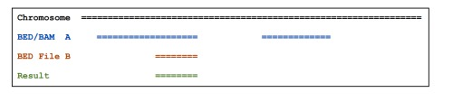

https://bioinf.comav.upv.es/courses/sequence_analysis/bedtools.html

## intersectBed：计算 Overlaps
```bash
bedtools intersect -a A.bed -b B.bed -wa -wb
```

加-wa参数可以报告出原始的在A文件中的feature

加-wb参数可以报告出原始的在B文件中的feature, 加-c参数可以报告出两个文件中的overlap的feature的数量。
当用bedtools intersect 处理大文件时比较耗内存，有效的方法是对A和B文件按照染色体名字(chromosome)和位置(position)排序(sort -k1,1 -k2,2n),然后用-sorted参数重新intersect。

Other arguments:
-wo 返回overlap碱基数
-v 返回非overlap区间
-s 相同链上的feature
-c 两个文件中的overlap的feature的数量
## complement：返回基因组非覆盖区
## slop：增加特征区间大小
## flank：提取特定区域(启动子区)